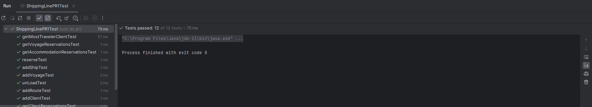
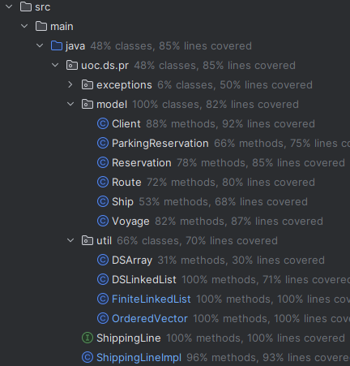
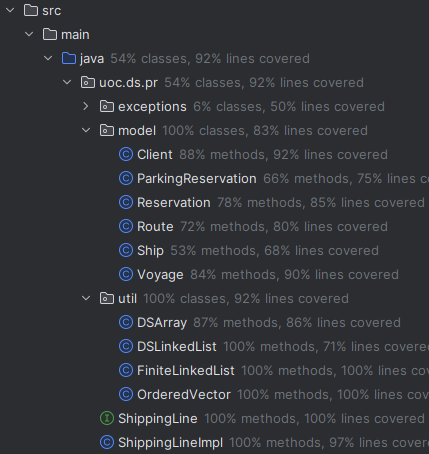
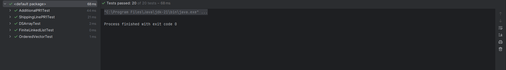

## PR1

## Author
- #name
- #email

## Introducción
En esta práctica, he tenido que implementar los modelos, los métodos de la clase ShippingLineImpl para que funcionen todos los tests de ShippingLinePR1Test.
También he tenido que crear los nuevos tests con otras casuísticas.
Ha sido complicado pero lo he conseguido.

## Desarrollo
**Modelos**

Lo primero que he hecho en este proyecto es crear los modelos en la carpeta **src/main/java/uoc/ds/pr/model**.
Los modelos que he implementado son:
+ Client
+ Ship
+ Route
+ Voyage
+ Reservation
+ ParkingReservation

Cada modelo tiene sus atributos, constructor, getters y setters.

**TADs**

Después he creado las estructuras de datos **DSArray**, **DSLinkedList**, **OrderedVector** y **FiniteLinkedList** en la carpeta **src/main/java/uoc/ds/pr/util**.

Para la clase de **DSArray** me he basado en la clase DictionaryArrayImpl de la librería.
He utilizado DSArray para guardar los buques (*Ship*) y trayectos (*Route*).

Para la clase **DSLinkedList** he extendido de la clase LinkedList de la librería.
He utilizado DSLinkedList para guardar los clientes (*Client*) y las travesías (*Voyage*).
También he añadido estas listas encadenadas en la clase *Voyage* para guardar las reservas (*Reservation*) de una travesía, 
en la clase *Route* para guardar las travesías de un trayecto y en la clase *Client* para guardar las reservas de un cliente.

Para la clase **OrderedVector** he mirado el test OrderedVectorTest y he implementado los métodos de la interfaz Fininte Container.
He utilizado OrderedVector para guardar de manera ordenada los clientes más viajeros y los trayectos más realizados.

Para la clase **FiniteLinkedList** he mirado el test FiniteLinkedListTest y he extendido de la clase LinkedList y he implementado solo el método isFull() de la interfaz FiniteContainer, ya que el resto de métodos ya están en la superclase.
He utilizado FiniteLinkedList para guardar las reservas de: butacas de una travesía, camarotes dobles de una travesía y camarotes cuádruples de una travesía.

**Excepciones**

He creado todas las excepciones que se necesitaban para ShippingLinePR1Test en la carpeta **src/main/java/uoc/ds/pr/exceptions**.
Todas las excepciones extienden de DSException.

**ShippingLineImpl**

Los métodos **addShip()** y **addRoute()** consiste en simplemente crear el objeto y llamar al método put() para guardar el objeto mediante clave (id) y valor (objeto).

El método **addClient()** consiste en crear el objeto y añadirlo al final de la lista encadenada con el método insertEnd().
También comprobamos si ya existe el cliente, para en ese caso actualizar sus datos.

El método **addVoyage()** consiste en crear el objeto, buscar el buque y la ruta, y añadirlo al final de la lista encadenada con el método insertEnd().
También comprobamos si ya existe la travesía, para en ese caso actualizar sus datos.

El método **reserve()** consiste en crear el objeto, buscar los clientes y travesía por los IDs, y añadirlo a las listas encadenadas de las reservas de travesías y clientes, y también a la FiniteLinkedList de la acomodación que toque.
Si en la reserva hay un vehículo, se añade a la lista de reservas con vehículo.
En caso de que la reserva sea de butacas, cada cliente tendrá un objeto de reserva diferente.

El método **load()** se utiliza para embarcar a los clientes (se marca como que ha embarcado) y vehículos (en orden LIFO).
Se comprueba si existe el cliente, la travesía y la reserva. También se comprueba si ya realizado el embarque.

El método **unload()** devuelve una lista en el orden que deben desembarcar los vehículos.

El método **unloadTime()** devuelve el tiempo de desembarque de un vehículo en minutos.

El método **getClientReservations()** primero obtiene el cliente por el id, después llama al método getReservations() del cliente y por último a values() para obtener el iterador que es lo que se devuelve.

El método **getVoyageReservations()** primero obtiene la travesía por el id, después llama al método getReservations() de la travesía y por último a values() para obtener el iterador que el lo que se devuelve.

El método **getAccommodationReservations()** devuelve un iterador con las reservas de la acomodación deseada.

El método **getMostTravelerClient()** devuelve el primer cliente del vector ordenado, ya que será el cliente más viajero. 

El método **getMostTraveledRoute()** devuelve el primer trayecto del vector ordenado, ya que será el trayecto más realizado.

Los métodos **getShip()** y **getRoutes()** llaman al método get() de DSArray para obtener el objeto con ese id. Si no se encuentra devuelve null.

Los métodos **getClient()** y **getVoyage()** utilizan un bucle while para buscar en el iterador el objeto con ese id. Si no se encuentra devuelve null.

Los métodos **numShips()**, **numRoutes()**, **numClients()**, **numVoyages()** obtienen el número total de estos llamando al método size() de la estructura de datos.

## Ampliación tests

Para crear nuevas casuísticas he creado otro archivo de test **AdditionalPR1Test** en la carpeta **src\test\java\uoc\ds\pr** y también **DSArrayTest** en la carpeta **src\test\java\uoc\ds\pr\util**.
Gracias a la respuesta de un compañero en el foro, he podido ver que líneas de código no estaban cubiertas por el ShippingLinePR1Test.

La opción **Run 'Tests in 'java' with Coverage** (click derecho sobre la carpeta java de test) genera un reporte con los porcentajes de líneas sin cubrir con tests, además en el editor de IntelliJ podemos ver las líneas que están cubiertas de color verde, y las no cubiertas de color rojo.

He cubierto algunas de las líneas que estaban en rojo con este nuevo test.
AdditionalPR1Test prueba algunas excepciones que no se habían probado en el otro test y el método unloadTime().
DSArrayTest prueba algunos métodos de la estructura de datos DSArray.

## Resultados tests

En la raíz del proyecto adjunto imágenes con el resultado de los tests. Se han ejecutado correctamente los 12 tests de ShippingLinePR1Test, los tests que ya habían en el proyecto y los nuevos tests.

Ejecución tests ShippingLinePR1Test:

Porcentajes de cobertura **antes** de crear los nuevos tests:

Porcentajes de cobertura **después** de crear los nuevos tests:

Ejecución de **todos** los tests del proyecto:

## Conclusión

En esta práctica he tenido que implementar las estructuras de datos **DSArray**, **DSLinkedList**, **FiniteLinkedList** y **OrderedVector**.
No me ha hecho falta crear otras estructuras ya que las que se especificaban en el enunciado de la PEC1 ya están en la librería DSLib.

Una vez he implementado todo para que funcione ShippingLinePR1Test, he creado los nuevos tests **AdditionalPR1Test** y **DSArrayTest**.

Ha sido complicado empezar la práctica, no entendía algunas cosas pero poco a poco fui entendiendo lo que tenía que hacer.
Las dudas/problemas que he tenido las he resuelto gracias al foro, ya que a otros compañeros les había pasado lo mismo.